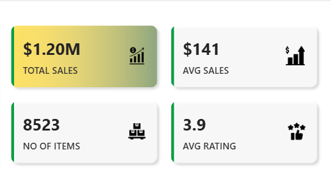
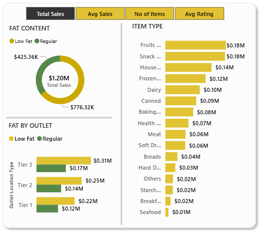
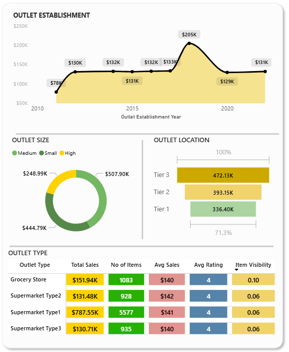

# Blinkit Grocery Sales Dashboard using Power BI

## 📊 Project Overview
This project analyzes Blinkit’s grocery sales data to evaluate product performance, outlet trends, and customer ratings across different regions. The goal is to gain insights that support data-driven decision-making.

## 🧩 Tools Used
- **Power BI** – for data visualization and dashboard creation  
- **Power Query Editor** – for cleaning and transforming data  
- **DAX** – for creating KPIs (Total Sales, Average Sales, Average Rating, Items Sold)  

## ⚙️ Key Steps
1. Imported and cleaned the grocery sales dataset  
2. Replaced inconsistent values (e.g., LF → Low Fat, reg → Regular, TF → Total Fat)  
3. Created DAX measures to calculate KPIs  
4. Designed an interactive Power BI dashboard with filters and visuals  

## 📈 Dashboard Highlights
- KPIs: Total Sales, Average Sales, Average Rating, Number of Items  
- Visuals: Sales by Item Type, Sales by Outlet Type, Fat Content Distribution, Yearly Trends  
- Interactive filters for outlet size, location type, and item category  

## 🖼️ Dashboard Screenshots
Below are some snapshots of the final dashboard:

  
  
  

## 📂 Project File
You can explore or download the dashboard here:  
👉 [Blinkit_Dashboard.pbix](Blinkit_Dashboard.pbix)

---

4. Scroll down, and under **Commit changes**:  
   - In the first box write → `Update README`  
   - Keep “Commit directly to the main branch” selected  
   - Click **Commit changes** ✅  

Then tell me **“done”**, and I’ll give you **Step 5: Final check and sharing tips.**
